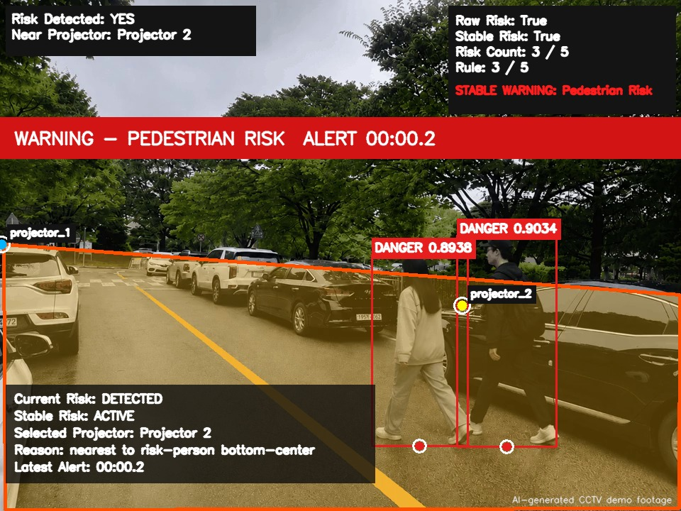

# CCTV 기반 보행자 위험 감지 시스템

주차장·CCTV 영상에서 보행자를 탐지하고, 설정한 위험 구역(ROI)에 진입한 상태가 일정 시간 지속되면 경고하는 YOLO 기반 프로젝트입니다.

## 주요 기능

- 이미지, 업로드 영상, OBS Virtual Camera 입력
- YOLO 기반 person 탐지와 모델 선택
- 원본 좌표계 기반 다각형 ROI 설정
- 프레임 단위 판정과 temporal filter를 조합한 안정 위험 판정
- 경고 이미지, CSV 로그, 결과 영상 및 경고음 생성
- 위험 보행자와 가장 가까운 노면 투사 장치 선택(mock dispatch)
- Streamlit UI와 OpenCV ROI 설정 도구
- validation 오류를 FN, FP, localization mismatch로 분류하는 분석 도구
- 원본 보호를 위한 dry-run/apply 분리와 자동 테스트

## 시연 영상

시연에는 개인정보와 저작권 문제를 피하기 위해 AI로 생성한 CCTV 영상을 사용했습니다.

[](docs/assets/demo_with_alert.mp4)

> 이미지를 클릭하면 경고음이 포함된 전체 시연 영상을 볼 수 있습니다. 영상은 Fine-tuned YOLO26n, 실제 ROI 판정, temporal filter와 cooldown 경고 로직을 사용합니다.

시연의 두 프로젝터는 영역이 아닌 점 좌표로 설정돼 있습니다. 위험 보행자의 bbox bottom-center와 가장 가까운 활성 장치를 선택하며, 영상은 선택된 실제 장치 마커와 선택 이유를 표시합니다. 외부 장치 전송은 안전한 mock dispatch입니다.

## 기술 스택

- Python 3.12
- Ultralytics YOLO26
- PyTorch / CUDA
- OpenCV, NumPy, pandas
- Streamlit
- pytest

PyTorch CUDA wheel은 운영체제와 CUDA 환경에 따라 설치 방법이 다르므로 [PyTorch 공식 설치 선택기](https://pytorch.org/get-started/locally/)를 사용합니다.

## 시스템 흐름

```text
이미지·영상·카메라 입력
        ↓
YOLO person 탐지
        ↓
bbox bottom-center와 ROI 포함 여부 판정
        ↓
temporal filter로 순간 오탐 억제
        ↓
경고 화면·이미지·CSV·영상·음성 출력
```

ROI는 선택 화면의 원본 이미지 좌표계로 저장합니다. 분석 프레임을 resize할 때 ROI도 같은 비율로 변환해 탐지 좌표와 일치시킵니다.

## Validation 성능 비교

네 결과를 Ultralytics 8.4.81, 동일 GPU, 동일 validation 960장(GT 4,538개)에서 `classes=[0]`, batch 16, workers 2 조건으로 다시 평가했습니다. pretrained 모델과 데이터셋의 class 0이 모두 `person`임을 확인했으며 **test split은 평가하지 않았습니다.**

| 모델 | 학습 상태 | 입력 크기 | Precision | Recall | mAP50 | mAP50-95 |
|---|---|---:|---:|---:|---:|---:|
| YOLO26n | Pretrained | 640 | 0.7094 | 0.4304 | 0.4980 | 0.2616 |
| YOLO26n | Pretrained | 768 | 0.7226 | 0.4586 | 0.5303 | 0.2734 |
| YOLO26n | Fine-tuned | 640 | 0.8478 | 0.6379 | 0.7429 | 0.4832 |
| YOLO26n | Fine-tuned | 768 | 0.8520 | 0.6671 | 0.7663 | 0.5100 |

Fine-tuning 절대 변화:

- 640: Precision `+13.84%p`, Recall `+20.76%p`, mAP50 `+24.49%p`, mAP50-95 `+22.16%p`
- 768: Precision `+12.94%p`, Recall `+20.85%p`, mAP50 `+23.60%p`, mAP50-95 `+23.66%p`

Validator가 측정한 순수 모델 inference 시간은 pretrained/fine-tuned 순으로 640에서 2.27/2.11ms, 768에서 3.16/3.01ms per image였습니다. 이는 영상 디코딩, ROI 판정, 시각화, 경고음 처리를 포함한 전체 애플리케이션 FPS가 아닙니다.

COCO pretrained 모델도 일반적인 사람 탐지 능력을 보였지만 목표 CCTV 데이터에 fine-tuning한 뒤 두 해상도 모두 Recall과 mAP가 상승했습니다. 이 프로젝트에서는 위험 보행자를 놓치지 않는 것이 중요하므로 Recall을 우선 확인합니다.

`mAP50`은 예측 박스와 정답 박스의 IoU가 0.50 이상인 조건에서 탐지 성능을 평가합니다. `mAP50-95`는 IoU 0.50부터 0.95까지 0.05 간격의 여러 기준에서 AP를 평균하므로 박스의 위치와 크기가 정답에 얼마나 정확히 맞는지를 더 엄격하게 반영합니다. 따라서 mAP50보다 mAP50-95가 낮은 것은 탐지 여부뿐 아니라 정밀한 위치 추정이 더 어려운 문제임을 보여 줍니다.

Fine-tuning으로 전반적인 성능이 개선됐지만 소형·원거리·가림·밀집 보행자에서는 여전히 개선 여지가 있습니다. 다음 단계는 야간·역광·우천·가림 조건의 데이터를 보강하고, 현재 학습·validation 구성과 분리된 외부 검증 세트를 구축하는 것입니다. 현재 수치는 동일 validation set의 비교 결과이며 새로운 환경의 일반화 성능이나 최종 배포 성능을 보장하지 않습니다.

## 설치와 실행

```powershell
python -m venv .venv
.\.venv\Scripts\python.exe -m pip install --upgrade pip
.\.venv\Scripts\python.exe -m pip install -r requirements.txt
.\.venv\Scripts\python.exe -m streamlit run app.py
```

모델 파일은 저장소에 포함되지 않습니다. Fine-tuned YOLO26n person-only 모델을 사용하는 경우 직접 확보한 `best.pt`를 다음 위치에 둡니다.

```text
models/fine_tuned/parking_yolo26n_person_only_best.pt
```

파일이 없으면 모델 선택지는 유지되지만 실행은 차단되고 필요한 경로가 UI에 안내됩니다. pretrained 모델도 자동 다운로드에 의존하지 않도록 필요한 weight를 프로젝트 루트에 직접 준비하는 방식을 권장합니다.

## 테스트

```powershell
.\.venv\Scripts\python.exe -m pip install -r requirements-dev.txt
.\.venv\Scripts\python.exe -m pytest tests -v
```

이번 작업 기준 원본 확장 테스트는 `342 passed`, 공개 패키지 테스트는 `204 passed`입니다. 테스트는 실제 카메라, 장시간 학습, test set 평가를 실행하지 않습니다.

## 데이터 품질 관리와 검증

- 원천 데이터의 `Person`, `Persona`, `ped` 등 보행자 클래스를 단일 `person` 클래스로 통합했습니다.
- 모든 이미지/라벨 쌍의 존재 여부와 YOLO 정규화 좌표 범위, 박스 유효성을 검증했습니다.
- 군중 밀도가 높거나 사람이 매우 작게 보이는 이미지, 목표 CCTV 도메인에 부적합한 후보를 별도 추출해 수동 검수했습니다.
- 수동 검수 결정은 `KEEP`, `DROP`, `HOLD`로 구분해 보류 항목이 자동 반영되지 않도록 했습니다.
- BBox 수정은 원본 YOLO label을 직접 덮어쓰지 않고 revision 정보와 함께 별도 SQLite에 저장했습니다.
- 원본 데이터·라벨·검수 결정을 보호하고, 데이터셋 생성은 dry-run과 apply 단계를 분리했습니다.
- Validation 예측 오류를 FN, FP, localization mismatch로 분류해 미탐·오탐·위치 부정확 문제를 구분했습니다.

## 프로젝트 구조

```text
app.py                         Streamlit 진입점
src/                           탐지, ROI, 위험 판정, 영상·경고 처리
scripts/                       실행 및 선택적 분석 도구
tests/                         단위·계약 테스트
docs/assets/                   공개 가능한 시연 영상과 포스터
config.example.yaml            경로 설정 예시(자동 로드하지 않음)
requirements.txt               실행 의존성
requirements-dev.txt           테스트 의존성
```

데이터, weight, validation raw run, 검수 DB와 개인 환경 파일은 공개 패키지에서 제외합니다.

## 데이터와 라이선스

데이터 준비 과정에서 사용한 로컬 export 메타데이터(`README.roboflow.txt`, `README.dataset.txt`, `data.yaml`)를 기준으로 출처와 버전을 다시 확인했습니다.

| 데이터셋 | 확인된 export 출처 | 메타데이터 라이선스와 주의사항 |
|---|---|---|
| cctv-naxyo v2 | [Roboflow Universe dataset/2](https://universe.roboflow.com/dataset-uutxr/cctv-naxyo/dataset/2) | CC BY 4.0 |
| PersonNormal v1 | [Roboflow Universe dataset/1](https://universe.roboflow.com/disertation-project/personnormal/dataset/1) | Public Domain |
| CityPersons conversion v9 | [Roboflow Universe dataset/9](https://universe.roboflow.com/citypersons-conversion/citypersons-woqjq/dataset/9) | 변환 프로젝트는 CC BY 4.0으로 표기돼 있지만, 원본 Cityscapes는 비상업적 사용만 허용하고 데이터 및 수정본 재배포를 금지합니다. [Cityscapes 원본 이용 조건](https://www.cityscapes-dataset.com/license/)이 우선 적용됩니다. |
| People Detection v11 RF-DETR Medium | [Roboflow Universe dataset/11](https://universe.roboflow.com/leo-ueno/people-detection-o4rdr/dataset/11) | `README.dataset.txt`에는 라이선스가 `undefined`, export `data.yaml`에는 `Private`로 기록돼 있어 프로젝트 수준의 명확한 공개 라이선스를 확인하지 못했습니다. |
| Person detection v15 | [Roboflow Universe dataset/15](https://universe.roboflow.com/titulacin/person-detection-9a6mk/dataset/15) | export 메타데이터는 CC BY 4.0으로 표기합니다. 다만 설명에 Unsplash와 Google Images에서 가져온 이미지가 포함되고 제공자가 대부분의 이미지를 소유하지 않는다고 명시돼 있어 원본 이미지 권리는 불확실합니다. |

저장소에는 원본·가공 데이터, label, validation raw run과 학습 weight를 포함하지 않습니다. 위 표의 라이선스 표기는 각 export 메타데이터를 기록한 것이며, 원본 이미지의 권리나 모든 사용 목적에 대한 허가를 대신하지 않습니다.

이 프로젝트는 Ultralytics를 사용합니다. Ultralytics는 AGPL-3.0과 Enterprise 라이선스 선택지를 제공하므로 배포 목적에 맞는 검토가 필요합니다. 프로젝트 자체 라이선스도 아직 확정하지 않았으며 자세한 상태는 `LICENSE_PENDING.md`에 기록했습니다.

## 제한사항

- 주차장 CCTV 환경을 중심으로 개발했으며 모든 카메라 각도·날씨·조명에서의 성능을 보장하지 않습니다.
- 노면 투사 장치 연동은 현재 mock dispatch까지만 구현했습니다.
- 자전거·오토바이 탑승자를 `person`으로 감지해 경고할 수 있습니다.
