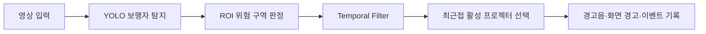
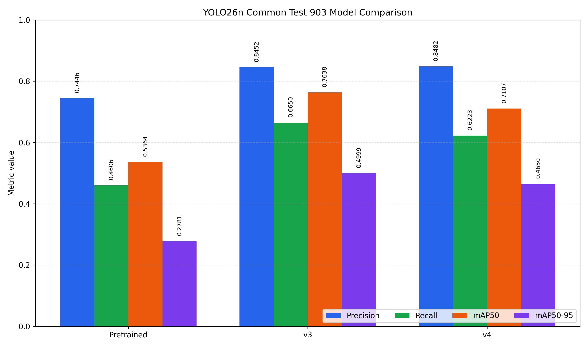
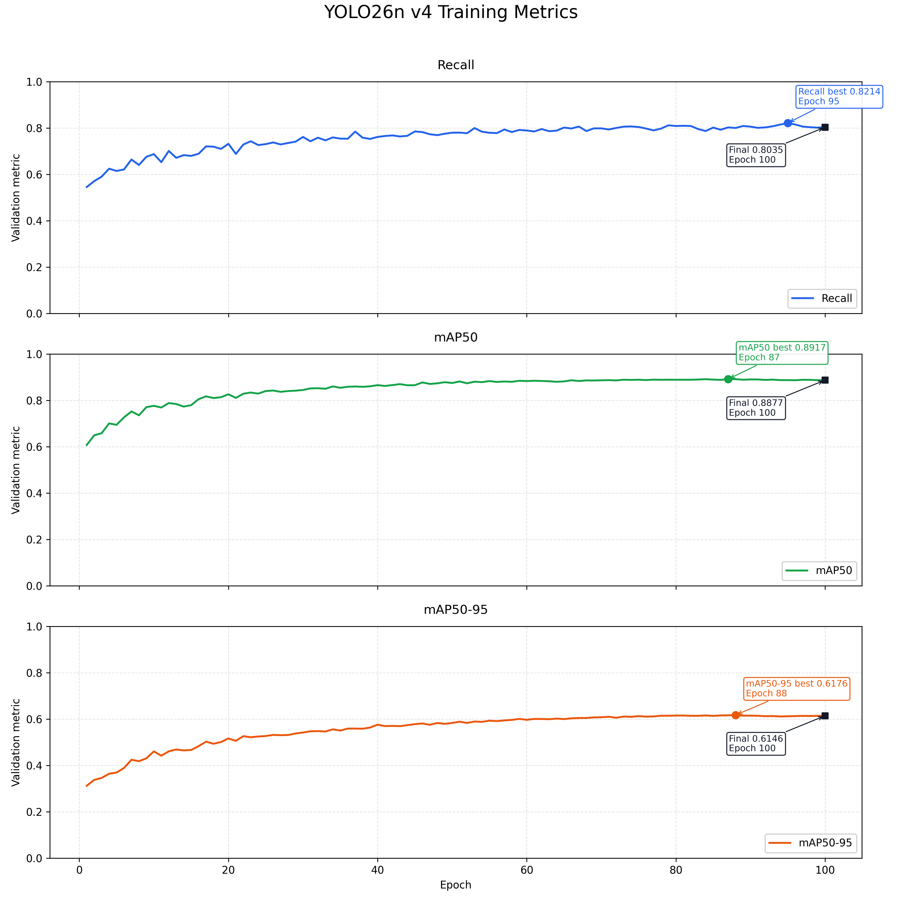
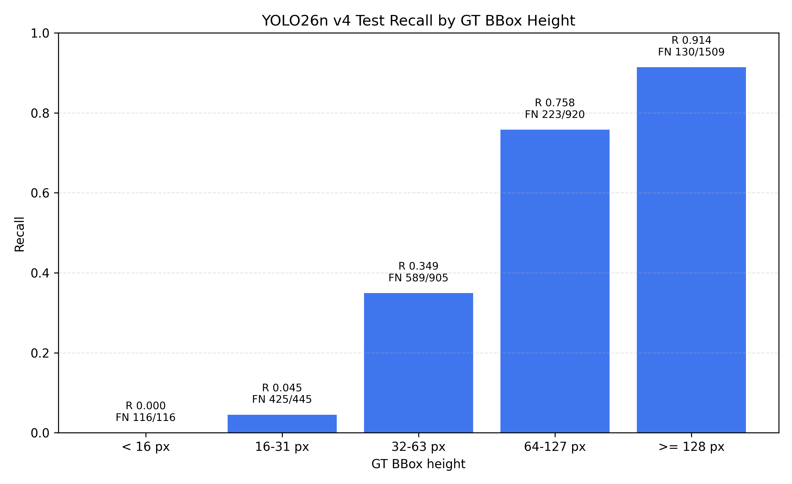
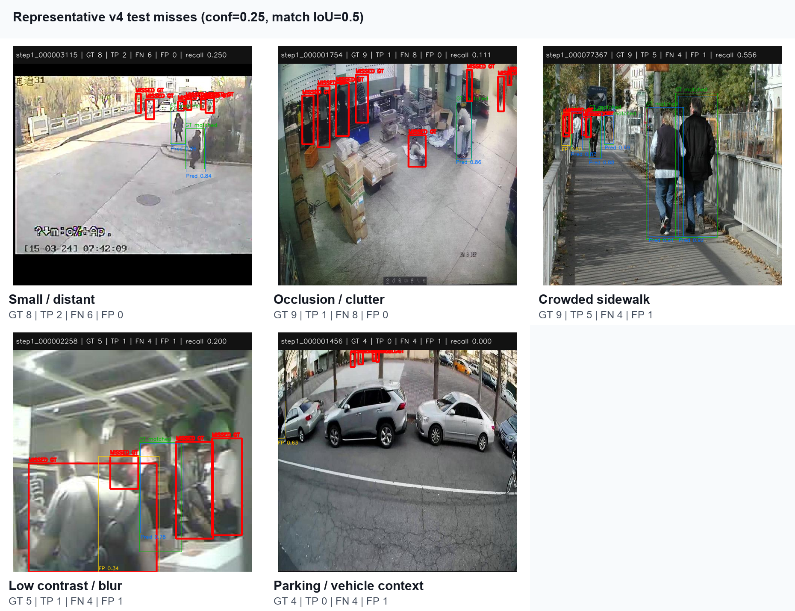

# CCTV 기반 보행자 위험 감지 시스템

주차장 CCTV 영상에서 위험 구역에 진입한 보행자를 감지하고, 경고음과 노면 투사 장치 선택 신호를 생성하는 영상 분석 시스템입니다.


## 시연 영상

[](docs/assets/demo_with_alert.mp4)

> 이미지를 클릭하면 경고음이 포함된 시연 영상을 확인할 수 있습니다. 개인정보와 저작권 문제를 피하기 위해 AI로 생성한 CCTV 영상을 사용했습니다.

## 프로젝트 개요

- 주차 차량이나 구조물 사이에서 나타나는 보행자를 CCTV 영상에서 탐지합니다.
- 보행자 위치와 ROI를 비교해 실제 위험 구역 진입 여부를 판단합니다.
- Temporal filter로 순간적인 오탐과 화면 깜빡임을 줄입니다.
- 위험 위치에서 가장 가까운 활성 프로젝터를 선택하고 경고 이벤트와 결과 영상을 기록합니다.
- 이미지, 업로드 영상, OBS 가상 카메라 및 일반 카메라 입력을 지원합니다.

## 핵심 기능

| 기능 | 설명 |
|---|---|
| 보행자 탐지 | Fine-tuned YOLO26n으로 영상 내 `person` 탐지 |
| 위험 구역 판정 | 보행자 bbox의 bottom-center가 ROI에 포함되는지 판단 |
| 시간축 안정화 | 연속 프레임 결과를 이용해 순간 오탐과 깜빡임 완화 |
| 경고 출력 | 위험 상태에서 화면 경고, 경고음 및 이벤트 로그 생성 |
| 프로젝터 선택 | 위험 보행자와 가장 가까운 활성 프로젝터 선택 |
| 입력 지원 | 이미지, 동영상, OBS 가상 카메라 및 일반 카메라 입력 |
| 결과 관리 | 처리 영상, 로그, CSV 및 분석 결과 저장 |

## Validation 성능 비교

| Model | Training | Input Size | Precision | Recall | mAP50 | mAP50-95 |
|---|---|---:|---:|---:|---:|---:|
| YOLO26n | COCO Pretrained | 640 | 0.7094 | 0.4304 | 0.4980 | 0.2616 |
| YOLO26n | COCO Pretrained | 768 | 0.7226 | 0.4586 | 0.5303 | 0.2734 |
| YOLO26n | Fine-tuned | 640 | 0.8478 | 0.6379 | 0.7429 | 0.4832 |
| YOLO26n | Fine-tuned | 768 | 0.8520 | 0.6671 | 0.7663 | 0.5100 |

모든 모델은 동일한 validation 데이터에서 person 클래스를 기준으로 비교했으며, 표의 수치는 test가 아닌 validation 결과입니다.

- Fine-tuning 후 입력 크기 640과 768에서 Recall이 각각 약 20.8%p 개선됐습니다.
- mAP50-95는 각각 약 22.2%p와 23.7%p 개선됐으며, 768 모델이 가장 높은 종합 성능을 기록했습니다.

`mAP50`은 IoU 0.50을 기준으로 탐지 성능을 평가하고, `mAP50-95`는 IoU 0.50~0.95의 여러 기준을 평균해 박스 위치와 크기의 정확도를 더 엄격하게 평가합니다.

Fine-tuning으로 성능이 개선됐지만 소형·원거리·가림·밀집 보행자에는 개선 여지가 있습니다. 다음 개선 방향은 야간·역광·우천·가림 조건의 데이터 보강과 외부 검증 세트 구축이며, 현재 validation 비교가 최종 배포 성능을 보장하지는 않습니다.

## 시스템 처리 흐름



## 주요 구현 내용

- YOLO 기반 이미지·동영상·실시간 입력 탐지 파이프라인
- 마우스 기반 ROI 설정, JSON 저장 및 분석 해상도에 맞춘 좌표 변환
- bbox bottom-center 기준 위험 구역 판정
- Temporal filter와 cooldown 기반 경고 처리
- 결과 영상에 BBox, ROI, 상태 및 프로젝터 선택 결과 표시
- 경고음이 포함된 결과 영상 생성
- Streamlit UI와 OBS 가상 카메라·일반 카메라 입력 연동
- 데이터셋 검수, BBox 수정 및 dry-run/apply 기반 버전 관리
- FN, FP, localization mismatch 분석 도구와 자동화 테스트 구축

## 데이터 품질 관리와 검증

- 여러 출처의 보행자 클래스를 단일 `person` 클래스로 통합했습니다.
- 이미지·라벨 쌍, 좌표 범위, 누락 및 중복을 검증했습니다.
- 군중·소형 객체·목적 부적합 후보를 수동 검수하고 `KEEP`, `DROP`, `HOLD`로 구분했습니다.
- BBox 수정 내역은 원본 label과 분리된 SQLite에 저장했습니다.
- 원본을 직접 수정하지 않도록 데이터셋 생성의 dry-run과 apply 단계를 분리했습니다.
- Validation 오류를 FN, FP, localization mismatch로 분류해 분석했습니다.

## 기술 스택

| 분류 | 기술 |
|---|---|
| Language | Python |
| Detection | YOLO26n, Ultralytics, PyTorch |
| Vision | OpenCV |
| UI | Streamlit |
| Data | NumPy, Pandas, SQLite |
| Video | FFmpeg |
| Test | pytest |

## 설치와 실행

```powershell
git clone https://github.com/yhn6543/parking-pedestrian-warning.git
cd parking-pedestrian-warning

python -m venv .venv
.\.venv\Scripts\python.exe -m pip install --upgrade pip
.\.venv\Scripts\python.exe -m pip install -r requirements.txt
.\.venv\Scripts\python.exe -m streamlit run app.py
```

학습 데이터와 모델 weight는 저장소에 포함되지 않습니다. Fine-tuned YOLO26n 모델을 사용할 때는 직접 확보한 `best.pt`를 `models/fine_tuned/parking_yolo26n_person_only_best.pt`에 배치합니다.

## 테스트

```powershell
.\.venv\Scripts\python.exe -m pip install -r requirements-dev.txt
.\.venv\Scripts\python.exe -m pytest tests -v
```

## 프로젝트 구조

```text
app.py                         Streamlit 진입점
src/                           탐지, ROI, 위험 판정, 영상·경고 처리
scripts/                       실행 및 선택적 분석 도구
tests/                         단위·계약 테스트
docs/assets/                   공개 가능한 시연 영상과 포스터
config.example.yaml            경로 설정 예시(자동 로드하지 않음)
requirements.txt               실행 의존성
requirements-dev.txt           테스트 의존성
```

데이터, weight, validation raw run, 검수 DB와 개인 환경 파일은 공개 패키지에서 제외합니다.

## 데이터와 라이선스

| 데이터셋 | 출처 |
|---|---|
| cctv-naxyo v2 | [Roboflow Universe dataset/2](https://universe.roboflow.com/dataset-uutxr/cctv-naxyo/dataset/2) |
| PersonNormal v1 | [Roboflow Universe dataset/1](https://universe.roboflow.com/disertation-project/personnormal/dataset/1) |
| CityPersons conversion v9 | [Roboflow Universe dataset/9](https://universe.roboflow.com/citypersons-conversion/citypersons-woqjq/dataset/9) |
| People Detection v11 RF-DETR Medium | [Roboflow Universe dataset/11](https://universe.roboflow.com/leo-ueno/people-detection-o4rdr/dataset/11) |
| Person detection v15 | [Roboflow Universe dataset/15](https://universe.roboflow.com/titulacin/person-detection-9a6mk/dataset/15) |

## Model development update

### v3 to v4 data curation

| 항목 | v3 | v4 |
|---|---:|---:|
| 전체 이미지 | 9,600 | 7,575 |
| Train | 7,680 | 5,909 |
| Validation | 960 | 763 |
| Test | 960 | 903 |
| 제거 이미지 | - | 2,025 |
| 제거 비율 | - | 21.1% |
| retained BBox 편집 이미지 | - | 336 |
| 명시적 빈 라벨 이미지 | - | 26 |
| 전체 BBox | 25,817 | 24,760 |

v4는 사람인지 객관적으로 판별하기 어렵거나, 단일 사람 BBox 경계를 일관되게 지정하기 어렵거나, 라벨 오류·중복·극단적 도메인 불일치가 있는 이미지를 수동 검수해 제외했습니다. 작거나 검출하기 어렵다는 이유만으로 제거하지 않았으며, 사람과 경계가 명확한 차량 사이·주차장·가림 장면은 유지했습니다.

분할은 v3의 train/validation/test 배정을 그대로 보존하고 `DROP` 이미지만 제거했습니다. 새 무작위 분할이나 test→train 이동은 없었습니다. 모델 예측은 라벨 품질과 사람 존재 여부를 확인하는 보조 자료로만 사용했고, 예측 성공·실패 자체를 `DROP` 기준으로 사용하지 않았습니다. test 결과를 본 뒤 test 이미지를 추가 제거하지 않았으며, 미탐이 발생한 404장도 test에 그대로 남아 있습니다.

### Fair comparison on the common test set

세 모델을 v4의 동일한 test 903장(GT 3,895개)에서 `imgsz=768`, `conf=0.001`, NMS IoU `0.7`, `max_det=300`의 같은 조건으로 다시 평가했습니다.

| Model | Training data | Precision | Recall | mAP50 | mAP50-95 |
|---|---|---:|---:|---:|---:|
| YOLO26n Pretrained | COCO pretrained | 0.7446 | 0.4606 | 0.5364 | 0.2781 |
| YOLO26n v3 | v3, 9,600 images | 0.8452 | 0.6650 | 0.7638 | 0.4999 |
| YOLO26n v4 | v4, 7,575 images | 0.8482 | 0.6223 | 0.7107 | 0.4650 |

v4−v3 변화는 Precision `+0.2951%p`, Recall `−4.2619%p`, mAP50 `−5.3170%p`, mAP50-95 `−3.4863%p`였습니다. 즉 v4는 Precision이 소폭 높았지만 Recall과 mAP는 v3보다 낮았습니다. 데이터 정제가 모든 지표를 자동으로 높이지 않는다는 결과를 그대로 공개합니다.



위 표는 기존 `Validation 성능 비교`와 평가 데이터가 다른 공통 test 결과입니다. validation 수치와 직접 같은 값으로 비교할 수 없으며, 이 결과가 최종 배포 성능을 보장하지 않습니다.

### Training progress

v4 학습은 100 epochs 동안 진행됐습니다. validation 기준 최고값은 Recall `0.8214`(epoch 95), mAP50 `0.8917`(epoch 87), mAP50-95 `0.6176`(epoch 88)이었고 마지막 epoch까지 급격한 성능 붕괴는 관찰되지 않았습니다.



### Missed detection analysis

v4 test 903장을 `confidence=0.25`, match IoU `0.5`, NMS IoU `0.7`, `imgsz=768`로 별도 분석한 결과는 TP 2,412, FN 1,483, FP 427, 고정 threshold Recall 0.6193이었습니다. 미탐이 있는 이미지는 404장(완전 미탐 69장, 부분 미탐 335장)이었고, 미탐이 없는 이미지는 499장이었습니다. 이 고정 threshold 분석값은 mAP 계산이나 위 공통 test의 Ultralytics Recall과 다른 분석 조건입니다.





대표 예시는 재배포 조건이 확인된 `cctv-naxyo`(CC BY 4.0)와 `PersonNormal`(Public Domain)에서만 선정했습니다. 식별 가능한 얼굴과 차량 번호판이 없는지 원본 크기로 확인했으며, 출처·수치·선정 근거는 [상세 평가 문서](docs/v4_model_evaluation.md)에 기록했습니다.

### Limitations and next steps

- 32px 미만 원거리 보행자와 밀집·가림 장면에서 Recall이 매우 낮습니다.
- 현재 분석은 이미지 단위 객체 검출이며 temporal filtering과 실제 위험구역 판단은 별도 검증이 필요합니다.
- 야간·역광·우천·가림 조건의 독립 test, 소형 객체를 보존하는 고해상도·타일 추론, 차량 사이 보행자 중심의 외부 검증 세트를 다음 단계로 검토합니다.
- 현재 test 미탐 이미지는 train에 재사용하지 않습니다. 추가 학습 데이터는 별도로 수집하고 새 버전에서 split 이력을 관리합니다.

세부 평가 조건, 데이터 정제 원칙, BBox 높이별 수치와 공개 예시 라이선스는 [v4 model evaluation](docs/v4_model_evaluation.md)에서 확인할 수 있습니다.

## 제한사항

- 주차장 CCTV 환경을 중심으로 개발했으며 모든 카메라 각도·날씨·조명에서의 성능을 보장하지 않습니다.
- 노면 투사 장치 연동은 현재 mock dispatch까지만 구현했습니다.
- 자전거·오토바이 탑승자를 `person`으로 감지해 경고할 수 있습니다.
